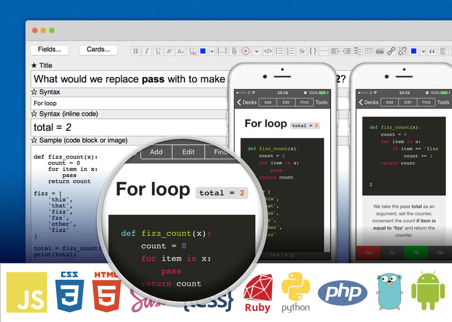

# Anki themes
## Learning to code with Anki: Themes, cards, templates & syntax highlighting

Want to learn how to code? This Anki programming theme will help make your Anki development decks a little more fun to work with. Inspired by the excellent [Janki method](#further-reading), spaced repetition software is a helpful learning tool for front-end and back-end programmers, beginner to experienced.

The template is built in html and css, with [syntax highlighting](./dist/themes/assets/css/README.md) for inline code and code blocks using the beautiful `Monokai` and `Tomorrow` themes — but fully customisable with [your own theme](http://color-themes.com/). Supports developer languages such as **html**, **css**, **python**, **elm**, **ruby**, **php**, **jquery**, **javascript** and whatever else you want to throw at it!



*Anki Themes: 'Simple' preview image* <sup><strong><em>[1](#other-notes)</em></strong></sup>


## Card Types

There are three types of cards to choose from:

1. **[Simple](./dist/themes/simple/README.md)**
  - What's the answer?
  - What does this syntax do?
2. **[Puzzle](./dist/themes/puzzle/README.md)**
  - What's the answer?
  - **+** Puzzle question
3. **[Cloze](./dist/themes/cloze/README.md)**
  - Freeform show/hide question/answer


## Anki syntax highlighting with Markdown

- **[Anki syntax highlighting and themes](./dist/themes/assets/README.md)**

Basic syntax highlighting can be achieved simply by wrapping `<code>` with html tags, such as `<b>`, `<i>`. This works nicely with Anki's editor buttons for quick code blocks or inline code. The included *Monokai* and *Tomorrow light* themes can be easily customised with [`stylus`](http://stylus-lang.com/).

If you like pretty code blocks, you're in luck: our themes work with [Pygments](http://pygments.org/)! You'll need to install a [required](#requirements) plugin, or [get your hands dirty with terminal](http://pygments.org/docs/cmdline/) if that's your thing.

Some fields are already wrapped with inline `<code>` tag, so all you need to do is add your code (i.e: symbol, class, function). The main `(code blocks ..)` will need to be wrapped with `<pre><code>`.

Each theme has [documentation](./dist/themes/simple/README.md), with further instructions.


#### Why use Anki Themes instead of an Anki plugin?

With **Anki themes**, you can use a `Markdown > HTML` workflow with *easily customisable* css. It works on all platforms, too: [AnkiMobile](http://ankisrs.net/docs/AnkiMobile.html), MacOS and [Android](https://github.com/ankidroid/Anki-Android).

> ***Practicality beats purity***
>
> Until Anki mobile allows javascript includes, it's safer to use Pygments than [a javascript equivalent](https://highlightjs.org/).


## Requirements

### NPM dependencies

If you're considering extending the theme, you'll need to install the required dependencies with [npm](https://www.npmjs.com/).

`cd` into the `anki` folder, then:

```node
npm install
```

This will install [cardinal stylus](https://github.com/badlydrawnrob/cardinal-stylus) and any other dependencies.

### Power format pack

You'll probably want to install **Power format pack** (_PFP_), a solid Markdown plugin for Anki — it compliments *Anki themes* and makes for a nice workflow.

I generally prefer to limit plugin use wherever possible, but in my experience _PFP_ really speeds things up.

If you'd prefer to use stock Anki, [see these notes](./dist/themes/assets/css/README.md#automatic-syntax-highlighting-with-pygments).


## Further reading

Not sure what all the fuss is about Anki? Some great reading material below ...

- [Anki essentials](http://alexvermeer.com/anki-essentials/)
- [Janki method](http://www.jackkinsella.ie/2011/12/05/janki-method.html)

### Installation

This is a major overhaul from the original (pre-beta), so it's not compatible with earlier versions. In future I'll try to stick to **major.minor.patch** [semantic versioning](http://semver.org), so updates don't break existing cards. Unfortunately Anki makes this tricky, so view commits for any major changes to the theme. [Follow the instructions](./dist/deck/README.md) for the easiest way to test the [.apkg package](./dist/deck) before updating future versions.


## License

Anki themes are licensed under the [MIT Open Source License](./license.md)


## Thanks to ...

1. Icons courtesy of [@kompa](http://devicon.fr)
2. Original Cardinal framework by [@cbracco](https://github.com/cbracco)
